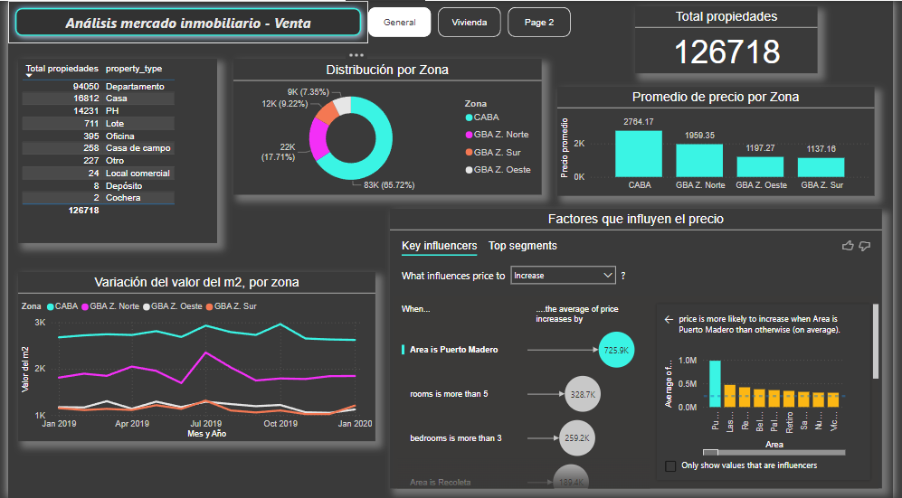
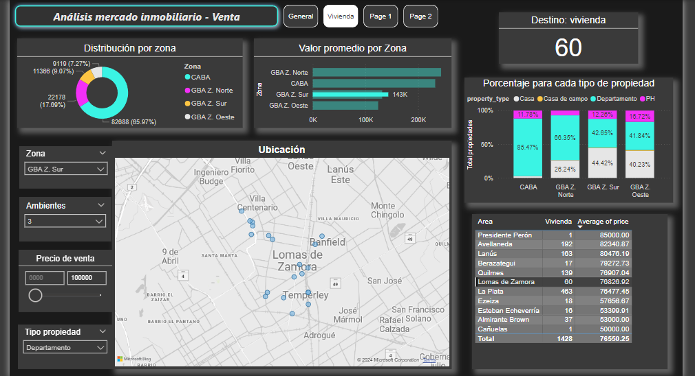

# PowerBI


En este repositorio podrás encontrar algunos de mis proyectos realizados con MS PowerBI Version 2.131.1203.0. 
Cada sección contiene un breve descripción del proyecto, vistas de los tableros, los pasos realizados para la visualización y el análisis y link al set de datos.<br><br><br><br>


Proyecto: Visualización y análisis de datos de mercado inmobiliario - año 2019
-------------

En este proyecto se analizan datos obtenidos de la plataforma Kaggle, que contienen información sobre la oferta inmobiliaria activa en el Gran Buenos Aires durante el año 2019. Los datos están disponibles aquí [dataset](https://www.kaggle.com/datasets/alejandromendivil/bsas-realstate-on-sale) y pueden descargarse como un archivo .csv.  <br><br>

_Limpieza y preparación de los datos_ <br>
Se cargó el set de datos en la aplicación de escritorio MSPowerBI con el objetivo de realizar un análisis exploratorio de los campos que contenía el archivo. Se utilizaron las funcionalidades de PowerQuery para analizar la calidad de datos de las columnas, cantidad de errores, datos faltantes, etc.  <br>

Se advirtió que del total de 146661 registros que contenía el archivo original, al cargarlo a PowerBI se multiplicaba la cantidad de filas, dando como resultado un total de 414146.  Para resolverlo, se utilizó como parámetro el campo que contiene el nombre del país, ya que la misma debería contener un solo dato único (Argentina). Se utilizó el filtro de  columna para comprobar que, en efecto, tal columna contenía datos irregulares, que fueron eliminados del modelo.<br>

Se renombraron las columnas País, Zona (Capital Federal, GBA Zona Sur, GBA Zona Norte y GBA Zona Oeste), Área (que contiene el nombre de los barrios/localidades) y se asignaron las categorías de datos correspondientes a las columnas de Longitud y Latitud y a las que contienen nombre del país, provincia, ciudad, etc. y se agregó una columna que calcula el valor del metro cuadrado.  <br><br>

_Herramientas elegidas para la visualización_ <br>
En primera instancia se analizan los datos del total de las propiedades.  <br>
Se incluye una tarjeta que muestra el total de propiedades activas durante el año 2019. Se listan los tipos de propiedad y la cantidad de ofertas para cada una.  <br>
Se utilizó un gráfico de dona para mostrar la distribución por zona.  <br>
Se usó un gráfico de columnas para mostrar el valor promedio del metro cuadrado en cada una de las zonas. <br>
Con el objetivo de visualizar las variaciones en el precio del metro cuadrado, se incluye un gráfico de líneas, que muestra el valor promedio del metro cuadrado en cada mes del año 2019, permitiendo comparar entre zonas.  <br>
Por último, se incluyen influenciadores clave sobre el valor de las propiedades.  

<br><br>

<br><br>
### Propiedades destinadas a Vivienda

A continuación se analizarán los datos de propiedades destinadas a viviendas uni o multifamiliares.  

Para esto se decide conservar del total de los datos, solo aquellos que pertenezcan a las categorías Casa, Departamento, Casa de campo y PH. Se construye una medida calculada sobre el conteo de registros,  que incluya el filtro deseado: 
<br>
```dax
Vivienda =
CALCULATE(
COUNTROWS(inmo_bsas),
inmo_bsas[property_type] IN {"Casa", "Departamento", "PH", "Casa de campo"}
)
```
<br>
Se obtiene un total de 125351 propiedades destinadas a Vivienda familiar, y se muestra el dato en una tarjeta que servirá como referencia al resto del análisis. Cuando se apliquen segmentaciones, esta tarjeta mostrará la cantidad actualizada. <br><br>
Se utiliza un gráfico de dona, para analizar la distribución geográfica de las propiedades listadas para la venta.  <br><br>
Se obtiene el valor promedio por Zona: se comparan 4 zonas urbanas y suburbanas (Ciudad Autónoma, GBA Sur, GBA norte, GBA Oeste) con un gráfico de barras que muestra el valor de venta promedio. También va a permitir comparar el valor promedio de un segmento definido en función de un barrio específico (por ej Belgrano) y compararlo con el valor promedio de la zona (CABA).<br><br>
Se incluyen 4 filtros que permitirán segmentar el total de datos en función de las siguientes características:  zona, cantidad de ambientes, precio máximo y tipo de propiedad. El total de propiedades encontradas en función de los filtros aplicados se muestra en la tarjeta mencionada. <br>

Valores incluidos en los filtros:  <br>
***Filtro por número de ambientes***: a los fines del presente análisis, se elimina en la segmentación los registros con valores extremos en la variable número de ambientes. Los valores extremos quedan definidos como aquellos que superan en 2 veces el desvío estándar. Para esto se obtiene el promedio de ambientes (3.13) y el desvío estándar (1.39). Se fijó el valor máximo para ese segmentador la cantidad en 6. El porcentaje de registros con valores extremos en el número de ambientes fue de 2.2%. <br><br>
Se incluye un mapa que permite visualizar áreas de mayor o de menor concentración de las propiedades listadas. El mapa es interactivo y se actualiza en función de los filtros activos.  <br><br>
Se utiliza una tabla que contiene la distribución por barrio/localidad.  <br><br>
Se incluye un grafico de columnas apiladas para visualizar la composición relativa de la variable *Tipo de propiedad*, comparando entre zonas.  
<br>
<br>


